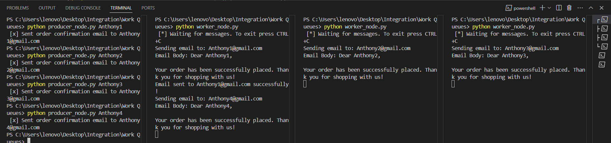
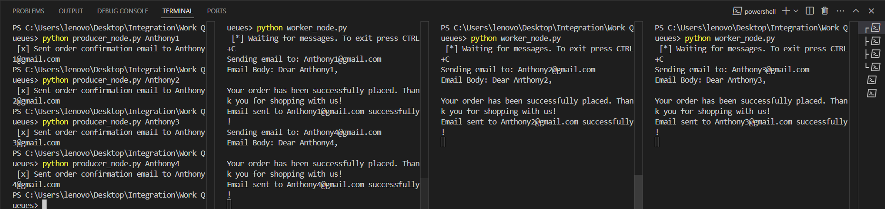
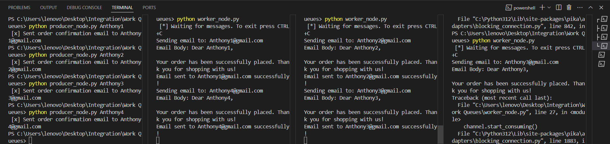

# E-Commerce Email Queue System using RabbitMQ

## Overview
This project demonstrates a simple producer-consumer system using RabbitMQ to handle email order confirmations. It comprises two Python scripts:

- **`producer_node.py`**: Acts as a producer that generates and sends messages (email tasks) to a RabbitMQ queue.
- **`worker_node.py`**: Acts as a consumer that retrieves messages from the queue and simulates sending the email.

---

## Components

### 1. `producer_node.py`
The producer creates a message (email task) and sends it to the `email_queue` queue. Here's what happens step by step:

#### **Connection to RabbitMQ**
- Establishes a connection to the RabbitMQ server running on `localhost`.
- Declares the `email_queue` queue as **durable** to ensure messages persist even if RabbitMQ restarts.

#### **Generate an Email Message**
- Reads the recipient's name from the command-line argument (`sys.argv[1]`), defaulting to `"customer"` if no argument is provided.
- Creates an email object as a Python dictionary containing:
  - The recipient's email.
  - The email body.

#### **Send the Message**
- Converts the email object to JSON format for easy serialization and sends it to the `email_queue`.
- Marks the message as **persistent** to ensure it is not lost if RabbitMQ crashes.

---

### 2. `worker_node.py`
The worker acts as a consumer, retrieving messages (email tasks) from the queue and simulating the process of sending an email. Here's what happens step by step:

#### **Connection to RabbitMQ**
- Connects to the RabbitMQ server and declares the same `email_queue` queue to ensure it exists.

#### **Waiting for Messages**
- Uses `basic_consume` to listen for messages on the `email_queue`.
- The `callback` function processes each message.

#### **Processing the Message**
- Decodes the received JSON message into a Python dictionary.
- Simulates email sending by:
  - Printing the recipient and email body.
  - Adding a 15-second delay using `time.sleep` to simulate the time taken to send an email.

#### **Acknowledgment**
- Sends an acknowledgment (`basic_ack`) to RabbitMQ to confirm the message was processed, allowing RabbitMQ to safely delete it from the queue.

#### **Quality of Service**
- Limits the number of unacknowledged messages to 1 (`prefetch_count=1`), ensuring the worker processes one message at a time.

## Case 1: Normal Task Distribution
In this scenario, all tasks are evenly distributed among available workers. 

### Process
1. **Producer** sends multiple tasks (email messages) to the `email_queue`.
2. Multiple **workers** consume tasks in a round-robin manner.
3. Each worker acknowledges the task upon completion, ensuring that RabbitMQ removes it from the queue.

### Screenshot
Below is a screenshot of the system in action, showing tasks being distributed among workers:




---

## Case 2: Task Redistribution on Worker Failure
In this scenario, one of the workers fails before acknowledging the task. RabbitMQ redistributes the unacknowledged task to another available worker.

### Process
1. **Producer** sends tasks to the `email_queue`.
2. Tasks are distributed among workers, but one worker crashes or stops unexpectedly.
3. RabbitMQ detects the unacknowledged task and redistributes it to a functioning worker.
4. The new worker processes the task and acknowledges it.

### Screenshot
Below is a screenshot showing the task being redistributed after a worker failure:



# Steps to Run the Email Queue System

1. Start RabbitMQ using Docker:

```bash
docker run -it --rm --name rabbitmq -p 5672:5672 -p 15672:15672 rabbitmq:4.0-management
```

2. Run the worker nodes in 3 different terminals:

```bash
python worker_node.py
```

3. Run the producer node:

```bash
python producer_node.py
```